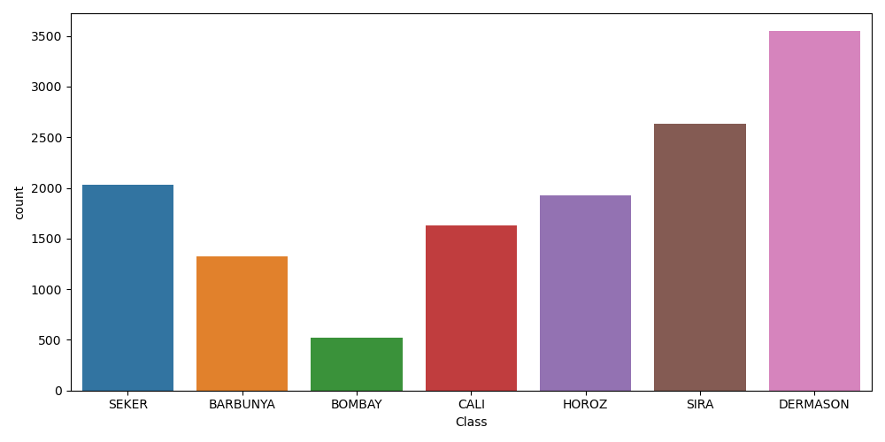
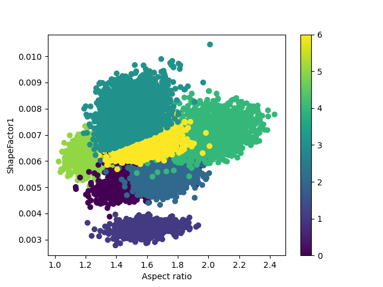
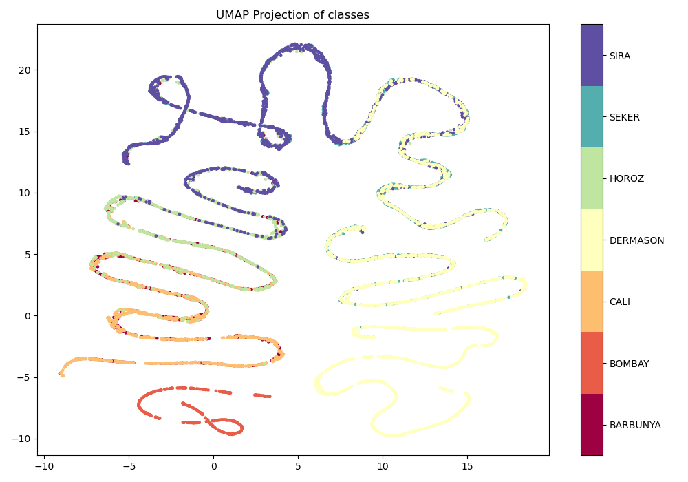
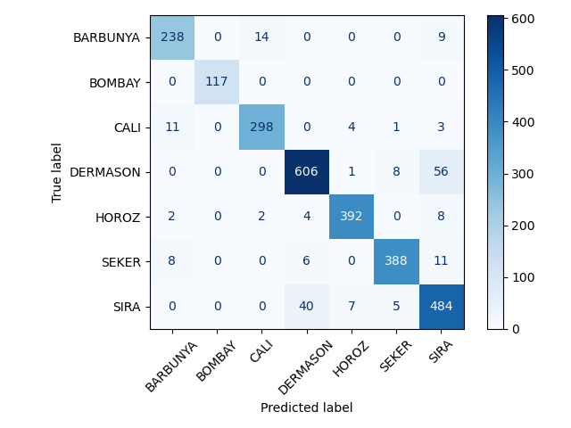
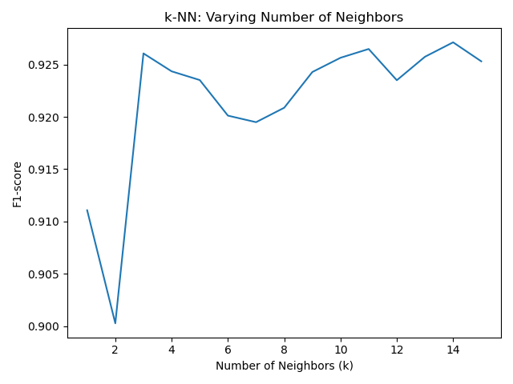
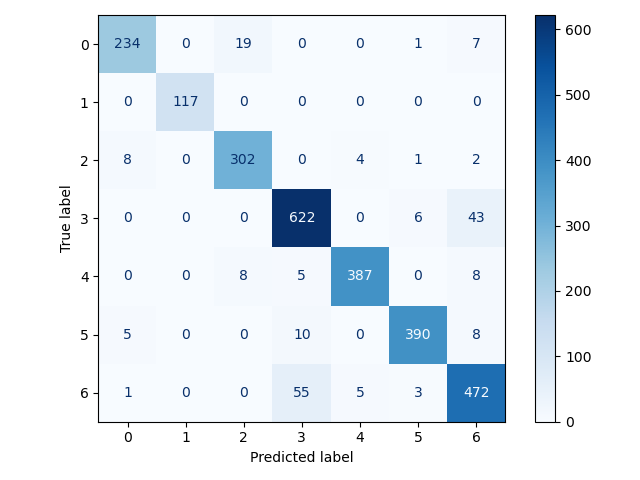
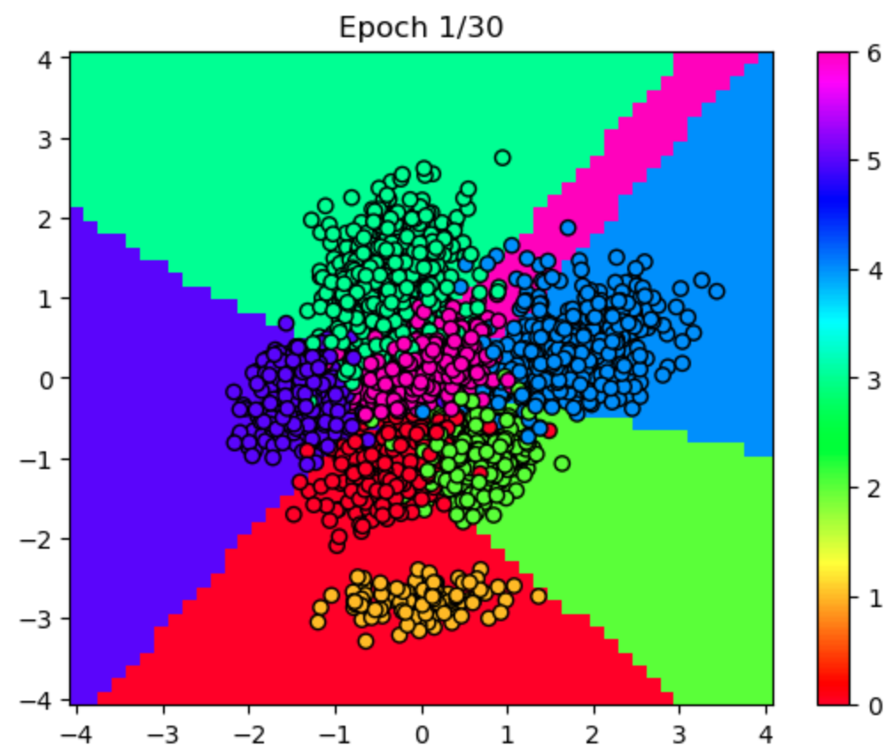
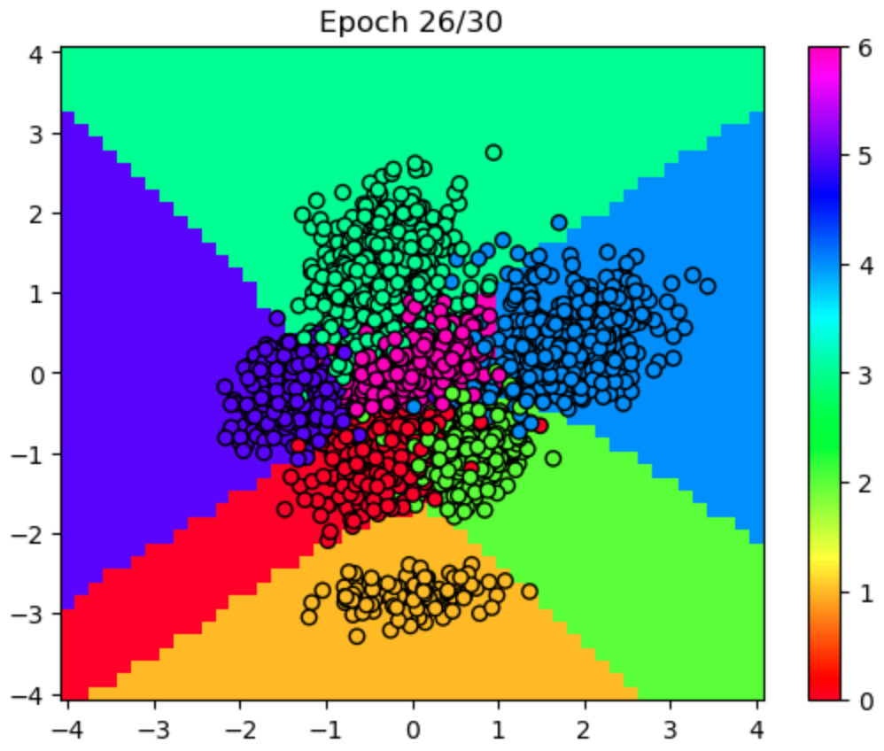
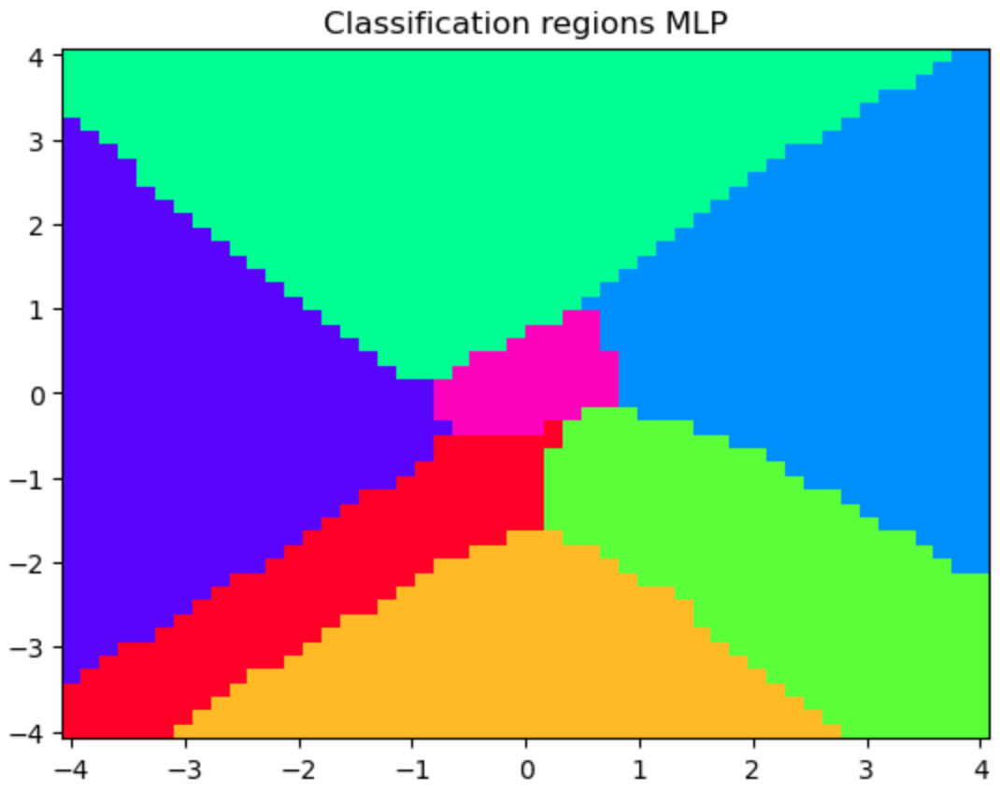

---

# 🌱 Classification of Dry Beans with Machine Learning

#### Sergio Alberto De León Martínez

## 📄 Abstract

We explored different machine learning techniques to analyze and classify seven kinds of dry beans.
beans. First, we performed a brief exploratory data analysis using standard techniques, such as UMAP
for data visualization. Then, we carried out a classification analysis where we compared
two different approaches. Finally, we present some results and conclusions

## 📊 Introduction

The integration of machine learning tools in agriculture has become crucial due to their ability to improve efficiency and accuracy in various tasks, from seed classification to yield prediction. In the specific case of dry beans, these tools are especially valuable given the wide genetic diversity and economic importance of this crop.

Dry beans (Phaseolus vulgaris L.) are the most widely produced legumes worldwide, and their seed quality significantly influences agricultural production. Accurate seed grading is essential not only for marketing, but also for ensuring sustainable agricultural systems.

This study highlights the development of an artificial intelligence-based system to classify seven registered dry bean varieties with similar morphological characteristics. By using machine learning models such as logistic regression (LR), k-nearest neighbors (kNN), and multilayer perceptron (MLP), high accuracy in seed classification was achieved.

## 🔍 Data Exploration

Let's first perform a brief data exploration. As we can see in the graph below, the classes are unbalanced. This is important because a metric such as accuracy will not tell us much about the performance of a model; instead, a metric such as f1-score will be more appropriate.

*Figure 1: Class Count*

It is interesting to visualize what the dataset looks like if we consider only two features, so we plot it. For example, let's consider "Aspect Ratio" and "ShapeFactor1". From this, we can detect a clear distinction between the classes, at least inherited from only two features. We will return to this example later in this paper.

*Figure 2: Projection with Two Features*

We can go further and apply a dimensionality reduction algorithm. In this case, we chose UMAP because of the mathematical framework on which it is based. The algorithm preserves the geometry of the data; for example, points originally close or far away are kept that way. After running the algorithm several times with different seeds, we obtain the following visualization.

*Figure 3: UMAP Projection*

This graph exhibits the performance of the UMAP algorithm. Even after considering the full feature set, we can still distinguish the separation between classes.

## 🧮 Logistic Regression

We are now in a position to construct a classification model. Let us first consider logistic regression, which is a linear classifier with the special feature that the parameters are estimated in probability space. Using the sklearn library, we obtain a weighted f1-score = 0.93} and an accuracy = 0.93}. We show the confusion matrix for this model.

*Figure 4: Confusion Matrix for Logistic Regression*

## 🔍 K-NN

Now let us consider a k-nearest neighbor (kNN) approach. As always, it is not clear what the optimal value of k is. We will consider the predictive power of the model, so let's calculate the f1-score for several values of k and keep the one with the best performance. The graph of k vs f1-score is shown below.

*Figure 5: k vs F1-score*

We conclude that for k=14 a reasonable performance is achieved, so from here on we maintain this value, again achieving a °textbf{f1-score = 0.93} and °textbf{precision = 0.93}, with the following confusion matrix.

*Figure 6: Confusion Matrix for K-NN*

As we can see, both classifiers have similar behavior.

## 🧠 Multilayer Perceptron

Finally, we performed a simple neural network analysis. This approach is currently a trend due to its effectiveness on complex tasks, but it lacks interpretability. We will address this later with a simplification of the problem. First, we use a single hidden layer model of $32$ neurons, and $tanh$ as the activation function. We use the cross-entropy loss function as the objective to be minimized with stochastic gradient descent. The model was trained with $30$ epochs and a learning rate of $0.001$. As in the previous classifiers, we split the data into training and validation, obtaining a \textbf{precision = 0.91} on the validation data set.

Now let us consider \ref{2feat}. Is it possible for a neural network to divide the plane according to the points belonging to the different classes as in the graph. To answer this question, it is necessary to follow the learning of the neural network. In only the first epoch, the MLP does a reasonable job.

### Early Epoch Performance

*Figure 7: Learning Stage, Epoch = 1*

But at this early stage, we can observe two important errors. First, there is a whole class that is incorrectly classified (the orange one) and the region in pink can be further delimited. However, in the following epochs, this situation is corrected, as we can see in how the plane is finally divided.

*Figures 8 & 9: Final Learning Stage*

## 📝 Conclusion

This study demonstrates the effectiveness of various machine learning models in classifying dry beans into seven distinct classes. Through detailed exploratory data analysis, it was evident that the classes are unbalanced, requiring the use of appropriate performance metrics, such as f1-score, rather than simple accuracy.

The application of dimensionality reduction techniques such as UMAP helped to visualize the inherent structure of the data, confirming the distinct separability of the classes. Classification analysis was performed using logistic regression, k-nearest neighbors (k-NN) and multilayer perceptron (MLP) models. Logistic regression and k-NN achieved high performance with f1-scores and accuracy of 0.93. MLP, despite its initial challenges with certain classes, successfully learned to classify the data with a validation accuracy of 0.91.

Overall, the integration of machine learning tools proved to be highly beneficial for dry bean classification, highlighting its potential for improving agricultural practices through accurate and efficient seed classification. Results indicate that both traditional and neural network-based classifiers can achieve high accuracy, with neural networks providing additional flexibility and potential for further performance improvements through hyperparameter tuning and more complex architectures.

## 📚 References

1. James, G., Witten, D., Hastie, T., & Tibshirani, R. (2013). *An Introduction to Statistical Learning: with Applications in R*. New York: Springer.

---